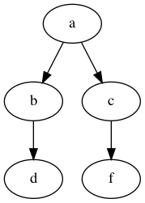

[](https://circleci.com/gh/fcbr/graph-algorithms)

# Installation

This package uses ASD definition files. The easiest way to use this is via [Quicklisp](https://www.quicklisp.org/).

To use, clone this repository and link it from your local `~/quicklisp/local-projects/`, for example:

```
$ cd ~/quicklisp/local-projects/
$ git clone https://github.com/fcbr/graph-algorithms.git
[...]
$ sbcl
This is SBCL 2.0.9, an implementation of ANSI Common Lisp.
More information about SBCL is available at <http://www.sbcl.org/>.

SBCL is free software, provided as is, with absolutely no warranty.
It is mostly in the public domain; some portions are provided under
BSD-style licenses.  See the CREDITS and COPYING files in the
distribution for more information.
* (require :graph-algorithms)
NIL
*
```

See the unit tests for sample usage of each of the defined methods.

# Testing

This package uses [FiveAM](https://github.com/lispci/fiveam/) for unit tests.

You can use the package `graph-algorithms/tests` for unit tests. Sample usage:

```
$ sbcl
* (require :graph-algorithms/tests)
* (graph-algorithms/tests::test-graph-algorithms)

Running test suite ALL-TESTS
 Running test BFS .
 Running test DEGREES .....
 Running test DIJKSTRA ...
 Running test MAXIMAL-CLIQUES .
 Running test STRONGLY-CONNECTED-COMPONENTS .
 Running test CONNECTED-COMPONENTS .
 Did 12 checks.
    Pass: 12 (100%)
    Skip: 0 ( 0%)
    Fail: 0 ( 0%)
```

# Documentation

## Degrees of vertices

```
(degrees vertices neighbors-fn)
```

Given a list of `VERTICES` and a `NEIGHBOR-FN` function, returns two
functions: one that gives the in degree of a vertex and another that
gives the out degree of a vertex.

## Breadth first search

```
(breadth-first-search source neighbors-fn visitor-fn)
```

Performs a breadth-first-search on the graph.  `SOURCE` is the vertex
used as the start of the search.  `NEIGHBORS-FN` should return a list of
immediate neighbor vertices of a given vertex.  `VISITOR-FN` is called
on each new vertex found by the search.

## Connected components

```
(connected-components vertices neighbors-fn visitor-fn)
```

`VERTICES` is the list of vertices of the graph. `NEIGHBORS-FN` should
return a list of immediate neighbor vertices of a given vertex.
`VISITOR-FN` is called once for each representative vertex of found
components.

## Shortest paths

```
(shortest-paths source vertices neighbors-fn)
```

Dijkstra's shortest patha algorithm.  All reachable vertices from
`SOURCE` are computed.  Returns `DIST` and `PREV` hash tables.  As in the
other methods, `NEIGHBORS-FN` is a function that receives a vertex and
returns its neighbors as a list of vertices.  Note that this
implementation does not consider weighted edges yet.

```
(reconstruct-path prev target)
```

Given the PREV hash table returned by DIJKSTRA, reconstruct the
path from the original source vertex to TARGET.

## Strongly connected components

```
(strongly-connected-components vertices neighbors-fn visitor-fn)
```

Tarjan's strongly connected components algorithm. `VERTICES` is
the list of vertices of the graph. `NEIGHBORS-FN` should return
a list of immediate neighbor vertices of a given vertex. `VISITOR-FN`
is called once for each SCC found.

## Maximal cliques

```
(maximal-cliques vertices neighbors-fn visitor-fn)
```

Implementation of the Bron–Kerbosch algorithm for finding maximal
cliques in an undirected graph, without pivoting.

# Sample usage

Your graph can be in any format or data structure as you want, as long as you provide a function to access the neighbors of a vertex.  For convenience sake, this sample uses [property lists](http://clhs.lisp.se/Body/26_glo_p.htm#property_list) as the data structure, where each vertex has an associated list of neighbours. This way, we can use Common Lisp's `GETF` accessor as the neighbor function.

```lisp
(defun sample-bfs ()
  (let ((graph
          '(:a (:b :c)
            :b (:d)
            :c (:f))))
    (bfs :a
         (lambda (n) (getf graph n))
         (lambda (n) (print n)))))
```

Sample call with output for the following graph:



```
* (sample-bfs)

:A
:B
:C
:D
:F
```


